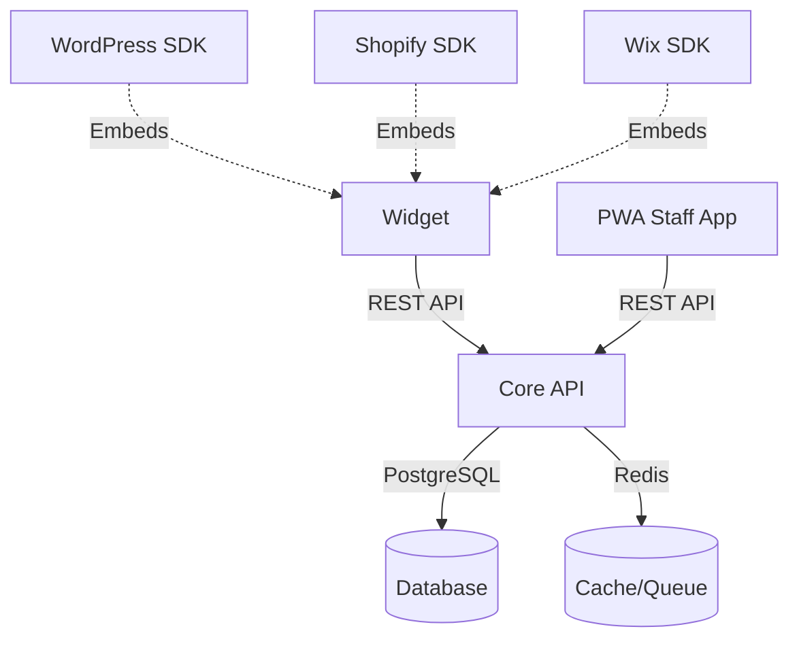

# Booking SaaS Monorepo

Multi-tenant headless booking SaaS with PWA staff app and embeddable widget.

## Architecture



## Tech Stack

- **Monorepo**: PNPM Workspaces + Turborepo
- **Core API**: NestJS + Prisma + PostgreSQL + Redis
- **PWA**: React + TypeScript + Vite + Workbox
- **Widget**: Web Components + TypeScript + Vite
- **CI/CD**: GitHub Actions + Semantic Release

## Quick Start

### Prerequisites

- Node.js 20.x (check `.nvmrc`)
- PNPM 8.14.0
- Docker & Docker Compose

### Installation

```bash
# Install dependencies
pnpm install

# Setup git hooks
pnpm prepare

# Start development
pnpm dev
```

### Commands

```bash
# Development
pnpm dev          # Start all apps in development mode
pnpm build        # Build all apps for production
pnpm test         # Run all tests
pnpm lint         # Lint all packages
pnpm typecheck    # Type-check all packages
pnpm format       # Format all files with Prettier
pnpm clean        # Clean all build artifacts

# Database (requires Docker)
pnpm db:migrate   # Run Prisma migrations
pnpm db:seed      # Seed database with demo data
pnpm db:reset     # Reset database
```

## Project Structure

```
.
├── apps/
│   ├── core-api/       # NestJS REST API
│   ├── pwa/            # React PWA for staff
│   └── widget/         # Web Component booking widget
├── packages/
│   ├── shared/         # Shared types and utilities
│   └── sdks/           # CMS integration SDKs
│       ├── wp/         # WordPress plugin
│       ├── shopify/    # Shopify app extension
│       └── wix/        # Wix Velo component
├── docs/               # API contracts and documentation
└── infra/
    └── docker/         # Docker configurations
```

## Definition of Done Checklist

- [ ] TypeScript strict mode enabled
- [ ] All files pass ESLint without warnings
- [ ] All files formatted with Prettier
- [ ] Unit tests written and passing
- [ ] Integration tests written and passing (where applicable)
- [ ] Code reviewed and approved
- [ ] Documentation updated
- [ ] Commits follow conventional commits format
- [ ] CI pipeline passes all checks

## Contributing

1. Create feature branch from `develop`
2. Make changes following code style
3. Write tests for new functionality
4. Ensure all CI checks pass
5. Create pull request to `develop`

## License

MIT License - see LICENSE file
